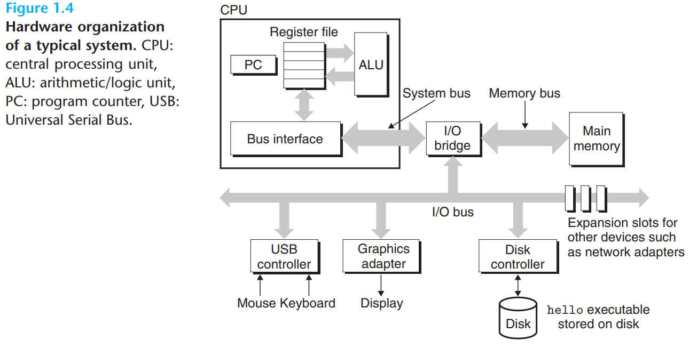
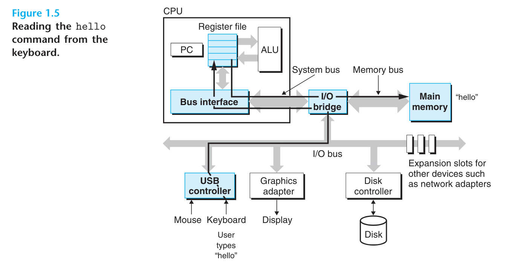
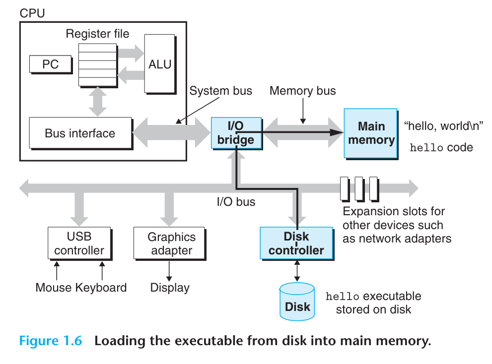
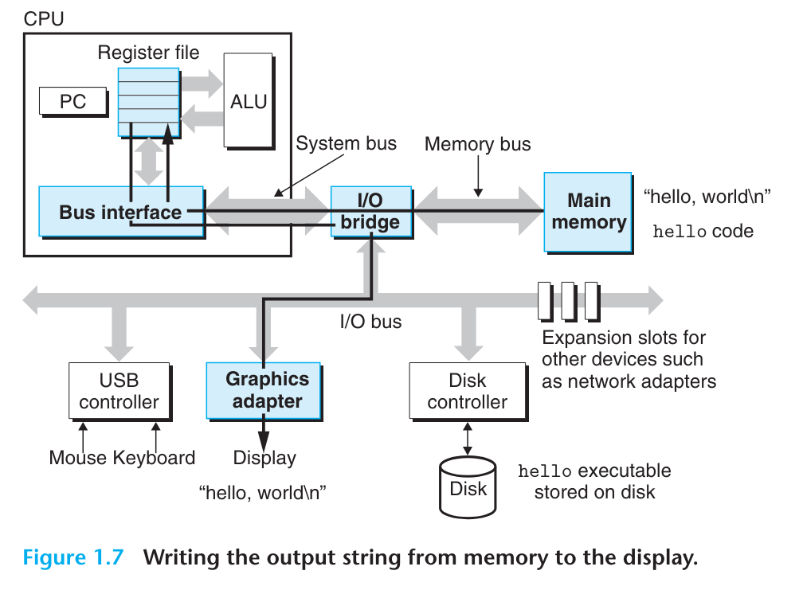

# 读书笔记

- 我们可以借助shell运行我们的程序。在命令行中输入可执行文件的命名，只要输入到命令行的第一个单词未对应任何shell內构命名，shell就会认为这是一个需要加载和运行的程序。shell在命令输入后，就会加载和运行我们的程序，直至程序结束运行，然后等待新的命令输入。
- 为了理解hello程序运行时发生了什么，我们需要先了解系统的硬件组织形式。图1.4模仿Intel系统描绘了经典系统硬件框架。我们会在整本书中分阶段详细介绍硬件系统框架图中各个部分的详细细节。
  - 计算机硬件系统充斥着总线。总线负责在各个组件间传输数个字节的数据。总线上传输数据的单位通常为“字”，字的大小作为系统的一个基本单位通常是固定的。字的大小会随系统而变化，现如今大多数机器的字大小是4字节（32位）或8字节（64位）。在本书中不会假定字的大小，相反，我们在字大小需要被定义的内容中，会明确给出这项信息。
  - I/O设备是系统与外部世界连接的桥梁。在我们的示例中有四种I/O设备：键盘、鼠标、显示器和硬盘。在最开始，hello程序就存储在硬盘中。每个I/O设备都通过控制器或适配器连接至I/O总线。控制器和适配器的主要区别在于封装形式。控制器是设备本身或主板上集成的芯片集，而适配器则是插入主板插槽的卡。不管如何，两者的作用都是在I/O设备和I/O总线间传输信息。
    - 第六章会更多地介绍如硬盘这样的I/O设备是如何工作的。在第十章，你会学习如何在自己的程序中借助UNIX I/O接口访问设备。我们会关注一类特别有趣的设备类型：网络，应用在网络上的技术在其它类型的设备上同样适用。

  - 主存是一个临时存储设备，同时持有着程序以及处理器运行程序时操作的数据。物理上来看，主存是由多个动态随机访问内存（DRAM）芯片组成的。逻辑上，主存的组织形式是线性字节数组，其中的每个字节都有其独特的从零开始计数的地址（数组索引）。
  - 组成程序的不同机器指令的字节长度会有所不同。C程序中，数据项的大小会随着变量类型改变。比如说，x86-64机器上运行的Linux系统，short型占用两个字节，int型和float型占用四个字节，long型和double型占用8个字节。
    - 第六章会更详细介绍形如DRAM芯片的内存技术是如何工作的，以及它们是如何结合起来形成主存的。

  - 中央处理单元（CPU），或者简单点说处理器，是执行内存中指令的引擎。其核心是一个字大小的存储设备，称作程序计数器（PC）。程序计数器始终指向着内存中的某些指令。
  - 从系统上电到系统断电，处理器始终重复着执行程序计数器指向的指令，和更新程序计数器指向下一条指令。
  - 处理器运作起来就像一个十分简单的指令执行模型，这个模型由指令集架构所定义。在模型中，指令按照严格的顺序执行，每条指令包含一系列步骤的执行。处理器从内存中读取PC所指向的指令，解析指令的每一个位，按照指令描述执行一些简单操作，然后更新程序计数器指向下一条指令。
  - 处理器所执行的简单操作只有几种，且都是围绕着主存、寄存器文件（register file）和算数逻辑单元（arithmetic/logic unit）展开的。寄存器文件是一种小型存储设备，它由一系列字大小的寄存器组成，其中每个寄存器都有其独特的名字。算数逻辑单元（ALU）负责计算新的数据和地址值。
  - 处理器所执行的简单操作包括：加载、存储、运算和跳转。加载是将数据从主存拷贝到寄存器，存储则相反，是将数据从寄存器写入到主存中。运算是将两个寄存器的内容拷贝到ALU执行算数运算，并将运算结果写回到寄存器。跳转是从指令中提取一个字的数据放到程序计数器中，覆盖程序计数器原先的内容。
  - 我们说处理器就像其是指令集架构的简单实现，但事实上，现代处理器使用远比这复杂的机制来提高程序执行速度。
    - 在第三章学习机器码时，我们会考虑机器指令架构提供的抽象。第四章中会更详细介绍处理器是如何真正实现的。第五章描绘了现代处理器的模型，其允许预测机器语言程序，以及优化其表现。

- hello程序执行时，发生了以下事情：
  - 最开始，shell程序执行着它的指令，等待着我们输入命令。当我们在键盘上输入./hello，shell程序便逐一读取输入字符到寄存器并最终保存至内存中。
  - 然后我们按下回车键，shell程序知道我们完成了命令的输入，开始将硬盘中hello目标文件的代码和数据拷贝到内存中。
  - 等到hello目标文件中的代码和内存全部加载进内存后，处理器就会开始执行hello程序中主函数的机器语言指令。这些指令将hello, world\n字符串的每个字节从内存拷贝到寄存器文件，然后再拷贝到显示器设备，最终字符便显示在了显示器上。


# 翻译

At this point, our hello.c source program has been translated by the compilation system into an executable object file called hello that is stored on disk. To run the executable file on a Unix system, we type its name to an application program known as a shell:

```shell
linux> ./hello
hello, world
linux>
```

到目前为止，我们的hello.c源程序已经由编译系统转换成了存储在硬盘中的可执行文件hello。在UNIX系统中我们可以通过在shell终端输入应用的名字，来执行可执行文件。

The shell is a command-line interpreter that prints a prompt, waits for you to type a command line, and then performs the command. If the first word of the command line does not correspond to a built-in command, then the shell assumes that it is the name of an executable file that it should load and run. So in this case, the shell loads and runs the hello program and then waits for it to terminate. The hello program prints its message to the screen and then terminates. The shell then prints a prompt and waits for the next input command line.

shell是一个命令行解释器，它可以输出提示，等待你输入命令，并展示命令执行的结果。如果输入的命令并未对应任意內构命令，则shell会认为所输入的字符是接下来需要加载和执行的可执行文件的名字。接着shell就会加载和执行hello程序，并等待它停止运行。hello程序将运行信息打印在了屏幕上，接着便停止了执行。最后shell打印了提示信息，并等待下一个输入的命令行。

## 1.4.1 Hardware Organization of a System

To understand what happens to our hello program when we run it, we need to understand the hardware organization of a typical system, which is shown in Figure 1.4. This particular picture is modeled after the family of recent Intel systems. but all systems have a similar look and feel. Don't worry about the complexity of this figure just now. We will get to its various details in stages throughout the course of the book.



为了理解hello程序在执行时发生了什么，我们需要理解经典计算机系统的硬件组织形式，如图1.4所示。这幅图展示的系统框架是基于最近Intel系列的硬件系统绘制的，大部分硬件系统都有着类似的结构。先别被这幅图的复杂程度吓到，我们将在整本书中分阶段了解其各种细节。

### Buses

Running throughout the system is a collection of electrical conduits called buses that carry bytes of information back and forth between the components. Buses are typically designed to transfer fixed-size chunks of bytes known as words. The number of bytes in a word (the word size) is a fundamental system parameter that varies across systems. Most machines today have word sizes of either 4 bytes (32 bits) or 8 bytes (64 bits). In this book, we do not assume any fixed definition of word size. Instead, we will specify what we mean by a "word" in any context that requires this to be defined.

整个计算机硬件系统都是称作“总线”的电子管线的合集，这些总线携带着数个字节的信息在组件之间穿梭。总线传输的数据大小通常是固定的，一条总线能传输的字节数通常被称为字。每个字包含的字节数是系统的一个基本参数，不同系统的字包含的字节数可能会不同。现如今大多数机器一个字包含4个字节（32位）或8个字节（64位）。本书中并不假设字拥有固定的字节数。相反，在必要时我们会给出字的具体含义。

### I/O Devices

Input/output (I/O) devices are the system's connection to the external word. Our example system has four I/O devices: a keyboard and mouse for user input, a display for user output, and a disk drive (or simply disk) for long-term storage of data and programs. Initially, the executable hello program resides on the disk. 

输入输出设备连接着系统与外面的世界。在我们的示例中，系统有四样输入输出设备：用于用户输入数据的键盘和鼠标、用于用户输出的显示器以及用于长期存储数据和程序的磁盘驱动（或简称磁盘）。最初，hello程序存在于磁盘中。

Each I/O devices is connected to the I/O bus by either controller or an adapter. The distinction between the two is mainly one of packaging. Controllers are chip sets in the devices itself or on the system's main printed circuit board (often called the motherboard). An adapter is a card that plugs into a slot on the motherboard. Regardless, the purpose of each is to transfer information back and forth between the I/O bus and an I/O devices.

每个I/O设备都通过控制器或适配器链接至I/O总线。控制器和适配器的主要区别在于封装：控制器是设备本身或主电路板（更通常的叫法是主板）上的芯片集；适配器是插入主板插槽的卡。但不管如何，两者的目的都是在I/O设备与I/O总线间传递信息。

Chapter 6 has more to say about how I/O devices such as disks work. In chapter 10, you will learn how to use the Unix I/O interface to access devices from your application programs. We focus on the especially interesting class of devices known as networks, but the techniques generalize to other kinds of devices as well.

第六章会更详细的阐述如磁盘这样的I/O设备是如何工作的。在第十章，你将会学习如何在自己的应用程序中使用UNIX的I/O接口来访问设备。我们会着重关注十分有趣的设备类别：网络，但相关的技术应用同样适用于其它设备。

### Main Memory

The main memory is a temporary storage device that holds both a program and the data it manipulates while the processor is executing the program. Physically, main memory consists of a collection of dynamic random access memory (DRAM) chips. Logically, memory is organized as a linear array of bytes, each with its own unique address (array index) starting at zero. In general, each of the machine instructions that constitute a program can consist of a variable number of bytes. The sizes of data items that correspond to C program variables vary according to type. For example, on an x86-64 machine running Linux, data of type short require 2 bytes, types int and float 4 bytes, and types long and double 8 bytes.

主存是临时存储设备，它同时持有程序，以及处理器执行程序时操作的数据。从物理上讲，主存包含一系列的动态随机访问内存（DRAM）芯片。从逻辑上讲，内存的组织形式是线性字节数组，数组的每个元素都有其独特的地址（数组索引），地址值从零开始计数。通常来讲，组成程序的每条机器指令所包含的字节数可以有所不同。C程序中变量所占用的字节数会随着变量的数据类型改变。比如，在x86-64机器上运行Linux系统，short型变量占2个字节，int型和float型变量占4个字节，long型和double型变量则占8个字节。

Chapter 6 has more to say about how memory technologies such as DRAM chips work, and how they are combined to form main memory.

第六章会更详细地介绍内存技术，例如DRAM芯片是如何工作地，以及它们是如何结合起来形成主存的。

### Processor

The central processing unit (CPU), or simply processor, is the engine that interprets (or executes) instructions stored in main memory. At its core is a word-size storage device (or register) called the program counter (PC). At any point in time, the PC points at (contains the address of) some machine-language instruction in main memory.

中央计算单元（CPU），或者简称处理器，是存储在主存中的指令的演绎（或称作执行）引擎。其核心是一个称作程序计数器（PC）的字大小的存储器（或称作寄存器）。程序计数器始终指向主存中的机器语言指令（即持有这些指令在主存中的存储地址）。

From the time that power is applied to the system until the time that the power is shut off, a processor repeatedly executes the instruction pointed at by program counter and updates the program counter to the next instruction. A processor appears to operate according to a very simple instruction execution model, defined by its instruction set architecture. In this model, instructions execute in strict sequence, and executing a single instruction involves performing a series of steps. The processor reads the instruction from memory pointed at by the program counter (PC), interprets the bits in the instruction, performs some simple operation dictated by the instruction, and then updates the PC to point to the next instruction, which may or may not be contiguous in memory to the instruction that was just executed.

从系统上电到系统断电，处理器始终重复执行着程序计数器指向的指令，并在指令执行完后更新程序计数器指向下一条指令。处理器运作起来就像一个简单指令的执行模型，该模型由其指令集架构所定义。在该模型中，指令严格按照顺序执行，并且单条指令涉及一系列操作。处理器从主存中读取程序计数器指向的指令，演绎指令中的位，执行指令所描述的某些简单操作，然后更新程序计数器至下一条指令，下一条指令可能紧挨着刚执行完的指令，也可能与刚执行完的指令的位置相差甚远。

There are only a few of these simple operations, and they revolve around main memory, the register file, and the arithmetic/logic unit (ALU). The register file is a small storage device that consists of a collection of word-size registers, each with its own unique name. The ALU computes new data and address values. Here are some examples of the simple operations that the CPU might carry out at the request of an instruction.

处理器能够执行的只有一些简单的指令，这些指令围绕着主存、寄存器堆和算数逻辑单元（ALU）工作。寄存器堆是一个小型存储设备，由多个字大小的寄存器组成，其中每个寄存器都有其各自的命名。逻辑计算单元计算着新的数据以及地址值。以下是一些示例，展示了CPU在指令请求下可能执行的动作：

- Load: Copy a byte or a word from main memory into a register, overwriting the previous contents of the register.
- 加载：从主存拷贝字节或字长度的数据到寄存器中，覆盖原先寄存器的数据。
- Store: Copy a byte or a word from a register to a location in main memory, overwriting the previous contents of that location.
- 存储：将字节或字长度的寄存器数据拷贝到主存的某一位置，覆盖这一位置上原先的数据。
- Operate: Copy the contents of two registers to the ALU, perform an arithmetic operation on the two words, and store the result in a register, overwriting the previous contents of that register.
- 运算：拷贝两个寄存器的数据到算数逻辑单元，得到两个数据的算数运算结果并存储至寄存器中，存储的同时会覆盖寄存器原先的内容。
- Jump: Extract a word from the instruction itself and copy that word into the program counter (PC), overwriting the previous value of the PC.
- 跳转：从指令本身提取一个字，并将该字拷贝到程序计数器中，覆盖程序计算器原先的值。

We say that a processor appears to be a simple implementation of its instruction set architecture, but in fact modern processors use far more complex mechanisms to speed up program execution. Thus, we can distinguish the processor's instruction set architecture, describing the effect of each machine-code instruction, from its microarchitecture, describing how the processor is actually implemented. When we study machine code in Chapter 3, we will consider the abstraction provided by the machine's instruction set architecture. Chapter 4 has more to say about how processors are actually implemented. Chapter 5 describes a model of how modern processors work that enables predicting and optimizing the performance of machine-language programs.

我们之前说过，处理器就像是其指令集架构的简单实现，但事实上，现代处理器使用了更加复杂的机制用来提高程序运行速度。因此，我们可以区分处理器的指令集架构，描述每一条机器代码指令的作用，从其微架构真正描述处理器的实现。当我们在第三章中开始学习机器代码时，会逐步探讨由指令集架构所提供的抽象。在第四章中，会更多地介绍处理器的实际实现。第五章，我们会介绍现代处理器的工作模型，其允许预测和优化机器语言程序。

## 1.4.2 Running the `hello` Program

Given this simple view of a system's hardware organization and operation, we can begin to understand that what happens when we run our example program. We must omit a lot of details here that will be filled later, but for now we will be content with the big picture.

在简单地了解了系统硬件的组成以及运作方式后，我们终于可以开始理解hello程序在运行时发生了什么了。在这里我们必须忽略一部分细节，之后我们会补上忽略的这部分内容，现在我们只需要知道个大概就行。

Initially, the shell program is executing its instructions, waiting for us to type a command. As we type the characters `./hello` at the keyboard, the shell program reads each one into a register and then stores it in memory, as shown in Figure 1.5.



最开始，shell程序执行着它的指令，等待我们输入命令。当我们在键盘上输入字符`./hello`时，shell程序会读取每一个输入字符到寄存器并最终存储到内存中，就像图1.5展示的那样。

When we hit the enter key on the keyboard, the shell knows that we have finished typing the command. The shell then loads the executable hello file by executing a sequence of instructions that copies the code and data in the hello object file from disk to main memory. The data includes the string of characters hello, world\n that will eventually be printed out.

当我们按下键盘上的Enter键时，shell会认为我们完成了命令的输入。接着shell便开始加载可执行程序hello，加载过程通常是执行一系列指令，将hello目标文件中的代码和数据从硬盘拷贝到主存中。加载的数据包括字符串“hello, world\n”，这串字符串最终将会被打印出来。

Using a technique known as direct memory access (DMA, dicussed in Chapter 6), the data travel directly from disk to main memory, without passing through the processor. This step is shown in Figure 1.6.



使用名为直接内存访问（DMA，将在第六章讨论），数据将能直接从硬盘拷贝到内存中，不需要再经过处理器传递。图1.6展示了这一步骤。

Once the code and data in the hello object file are loaded into memory, the processor begins executing the machine-language instructions in the hello program's main routine. These instructions copy the bytes in the hello, world\n string from memory to the register file, and from there to the display device, where they are displayed on the screen. This step is shown in Figure 1.7.



等到hello目标文件的代码和数据都被加载到内存中后，处理器便开始执行hello程序主函数中的机器语言指令。这些指令将hello, world\n字符串从内存拷贝到寄存器文件，再从寄存器文件拷贝到显示器设备，最终hello, world\n字符串便显示在了显示器上。图1.7展示了这一步骤。