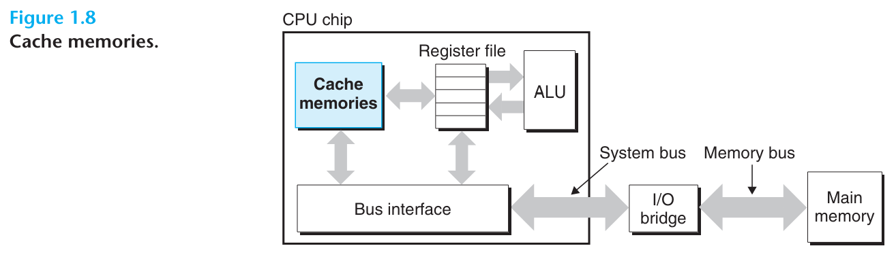

# 读书笔记

- 从hello程序这个例子中，我们可以看出系统花了不少时间在信息的搬运上。程序中的机器指令一开始存储在硬盘中，加载时会拷贝到内存中，运行时又拷贝到处理器中。类似的，字符数据一开始也存储在硬盘中，然后被拷贝进内存里，最终又拷贝到显示设备上。
- 从程序员的视角看，这些拷贝动作拖慢了程序的运行。因此系统设计者的一个主要目标，是尽可能地加快拷贝操作的执行。
- 由于物理法则限制，容量越大的存储设备，通常操作起来要比容量小的设备要慢。并且操作快的设备要比与其同等大小的较慢的设备造价要高。举例来讲，硬盘的空间大小可能是内存的一千倍，但处理器从硬盘读数据，要比从内存读数据慢上个一千倍。
- 类似的，一般的寄存器文件仅能存储几百个字节的数据，与之相对的，内存能存储数十亿个字节的数据。但处理器从内存读数据的速度，要比从寄存器文件读慢接近一百倍。更棘手的是，随着半导体技术发展，这种处理器与内存的性能差距会越来越大。使处理器跑得更快，要比使内存跑得更快容易和便宜得多。
- 为了解决处理器和内存之间的性能差距，系统设计者引入了称作缓冲存储（或简称缓存）的更小更快的存储设备。缓存用于临时存储处理器在不久的将来可能会用到的数据。
- 处理器中的L1缓存持有几万个字节的数据，能做到与寄存器文件几乎相同的访问速度。
- 更大的L2缓存则持有几十万到几百万字节的数据，它通过特殊的总线连接到处理器上。处理器访问L2缓存的速度要比访问L1缓存慢接近5倍，但这仍然比访问内存要快5-10倍。
- L1和L2缓存是通过一种叫做静态随机访问存储（static random access memory, SRAM）的硬件技术实现的。更新、性能更强的处理器，甚至又三级缓存：L1、L2和L3缓存。
- 缓存背后的核心思想是：处理器可以利用区域性来同时使容量大的存储设备和速度快的存储设备同时发挥作用。程序有一种访问本地数据和代码的趋势。通过使缓存持有更可能被经常访问的数据，我们可以让几乎所有的内存操作在缓存上执行。
- 本书给出的最重要的启发是：认识到缓存可以加以利用的应用程序员，可以通过利用缓存来使他们的程序性能提高一个数量级。
- 我们会在第六章中学习缓存设备，并了解如何利用它们。

# 翻译

An important lesson from this simple example is that a system spends a lot of time moving information from one place to another. The machine instructions in the hello program are originally stored on disk. When the program is loaded, they are copied to main memory. As the processor runs the program, instructions are copied from main memory into the processor. Similarly, the data string hello, world\n, originally on disk, is copied to main memory and then copied from main memory to display device. From a programmer's perspective, much of this copying is overhead that slows down the "real work" of the program. Thus, a major goal for system designers is to make these copy operations run as fast as possible.

hello程序这个简单例子给我们的一个重要启发是，系统花费了不少时间将信息从一个地方移动到另一个地方。hello程序中的机器指令一开始存储在硬盘上。当程序被加载，这些指令就从硬盘拷贝到的内存中。等到处理器运行程序，这些指令又从内存拷贝进了处理器。相似的，字符数据“hello, world\n”一开始也存储在硬盘中，它会先被拷贝到内存中，最终又被拷贝到显示设备上。从程序员的视角看，大多数的拷贝动作作为一种开销拖慢了程序的运行。因此，系统设计者的一个主要目标是让这些拷贝操作尽可能快的完成。

Because of physical laws, larger storage devices are slower than smaller storage devices. And faster devices are more expensive to build than their slower counterparts. For example, the disk drive on a typical system might be 1,000 times larger than the main memory, but it might take the processor 10,000,000 times longer to read a word from disk than from memory.

由于物理法则，大型存储设备要比小型存储设备慢得多，而速度更快的设备，造价往往要比速度慢的设备要高得多。举例来说，一般系统中磁盘的大小比内存大1千倍，但相比从内存读一个字的数据，处理器需要花1千万倍的时间才能完成相同的工作。

Similarly, a typical register file stores only a few hundred bytes of information, as opposed to billions of bytes in the main memory. However, the processor can read data from the register file almost 100 times faster than from memory. Even more troublesome, as semiconductor technology progresses over the years, this processor-memory gap continues to increase. It is easier and cheaper to make processors run faster than it is to make main memory run faster.

类似地，一般寄存器文件只存储几百个字节的信息，作为对比，内存能存储数十亿个字节的信息。但无论如何，处理器从寄存器读取数据，几乎要比从内存读取要快100倍。更糟糕的是，随着半导体技术发展，这种处理器与内存的差距会逐渐扩大。让处理器跑得更快的成本，远比让内存跑得更快要低。

To deal with the processor-memory gap, system designers include smaller, faster storage devices called cache memories (or simply caches) that serve as temporary staging areas for information that the processor is likely to need in the near future. Figure 1.8 shows the cache memories in a typical system. An L1 cache on the processor chip holds tens of thousands of bytes and can be accessed nearly fast as the register file. A larger L2 cache with hundreds of thousands to millions of bytes is connected to the processor by a special bus. It might take 5 times longer for the processor to access the L2 cache than the L1 cache, but this still 5 to 10 times faster than accessing the main memory. The L1 and L2 caches are implemented with a hardware technology known as static random access memory (SRAM). Newer and more powerful systems even have three levels of cache: L1, L2, and L3. The idea behind caching is that a system can get the effect of both a very larger memory and a very fast one by exploiting locality, the tendency for programs to access data and code in localized regions. By setting up caches to hold data that are likely to be accessed often, we can perform most memory operations using fast caches.

为了缓和处理器与内存的性能差距，系统设计者们引入了一种更小、更快的存储设备，这些设备称作缓冲存储器（或简称缓存），这种存储器作为临时存储区域，用于存放处理器在不久的将来很可能会用到的信息。图1.8展示了经典系统中的缓存。处理器芯片中的L1缓存通常能存储几万字节的数据，并且能做到几乎同寄存器文件一样快的访问速度。更大的L2缓存能存储几十万到几百万字节的数据，它们通过特殊的总线连接到处理器，但处理器访问它们的速度会比访问L1缓存慢5倍，但这仍然比访问内存要快5到10倍。L1和L2缓存是用一种叫做“静态随机访问内存”（static random access memory, SRAM）的硬件技术实现的。更新、性能更强的系统甚至有三级缓存：L1、L2和L3缓存。缓存背后的核心思想是系统可以利用区域性来使很大的内存和很快的内存同时发挥作用，因为程序倾向于访问本地的数据和代码。通过使缓存持有经常访问的数据，我们可以让大部分内存访问操作在更快的缓存上执行。

One of the most important lessons in this book is that application programmers who are aware of cache memories can exploit them to improve the performance of their programs by an order of magnitude. You will learn more about these important devices and how to exploit them in Chapter 6.

本书给出的最重要的启发是：应用程序员应该意识到，利用缓存可以让他们程序的性能提升一个数量级。你会在第六章了解更多关于缓存的信息，届时你还会了解到如何利用好缓存。