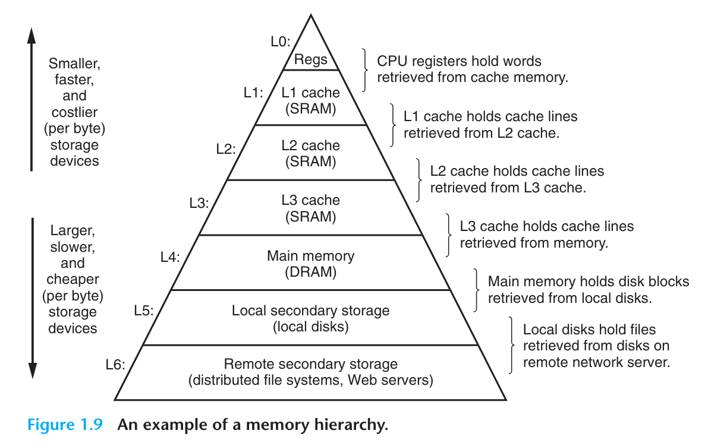

# 读书笔记

- 在处理器与访问速度较慢但容量较大的存储设备间插入访问速度更快、容量更小的设备，已经是普遍的做法。
- 事实上，每个计算机系统的存储设备都组织成了类似金字塔的结构。金字塔中，存储设备按照访问速度和容量大小向下排列，越靠近塔底的设备，访问速度越慢、容量越大，每字节造价越低。
- 占据内存金字塔塔顶端的，依次是寄存器文件、L1-L3缓存，再接着是内存，它们的等级分别为L0-L4。
- 内存金字塔的主要思想，是其中一级的存储设备为下一级的存储设备充当缓存。例如在某些有分布式文件系统的网络系统中，本地硬盘就为存储在其它设备上的数据充当缓存。
- 程序员们可以利用对不同内存的了解，以及对内存金字塔的理解提高程序的性能。在第六章中我们会详细讨论此话题。

# 翻译

This notion of inserting a smaller, faster storage device (e.g., cache memory) between the processor and a larger, slower device (e.g., main memory) turns out to be a general idea. In fact, the storage devices in every computer are organized as a memory hierarchy similar to Figure 1.9. As we move from the top of the hierarchy to the bottom, the devices become slower, larger, and less costly per byte. The register file occupies the top level in the hierarchy, which is known as level 0 or L0. We show three levels of caching L1 to L3, occupying memory hierarchy levels 1 to 3. Main memory occupies level 4, and so on.

这种在处理器与更大、更慢的内存设备中，插入更小、更快的存储设备的想法，已经十分普遍。事实上，每台电脑上的存储设备都组织成了类似图1.9所示的金字塔结构。从金字塔顶往下看，存储设备的访问速度逐渐变慢、容量逐渐变大，每字节的造价则变得更低。寄存器文件占据着塔顶，被称作等级0或L0的内存设备。我们展示了3级缓存结构：L1到L3，它们占据着内存金字塔的1到3级。内存则占据着第4级，往下以此类推。

The main idea of a memory hierarchy is that storage at one level serves as a cache for storage at the next lower level. Thus, the register file is a cache for the L1 cache. Caches L1 and L2 are caches for L2 and L3, respectively. The L3 cache is a cache for the main memory, which is a cache for the disk. On some networked systems with distributed file system, the local disk serves as a cache for data stored on the disks of other systems.

内存金字塔的一个主要思想，是其中一级的存储设备为下一级存储设备缓存数据。因此，寄存器文件缓存着L1缓存的数据。L1缓存和L2缓存分别作为L2缓存和L3缓存的缓存，以此类推。L3缓存作为内存的缓存，内存又作为硬盘的缓存。在某些有分布式文件系统的网络系统上，本地硬盘又作为存储在其它系统上的硬盘数据的缓存。

Just as programmers can exploit knowledge of the different caches to improve performance, programmers can exploit their understanding of the entire memory hierarchy. Chapter 6 will have much more to say about this.

正如程序员们可以利用对不同缓存的了解来提高程序性能，他们同样能利用对内存金字塔的理解来达成此事。在第六章中我们会更详细介绍这个话题。