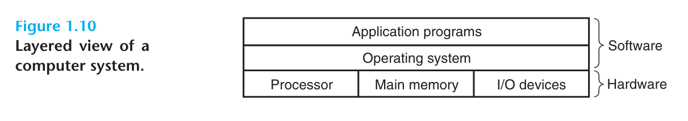
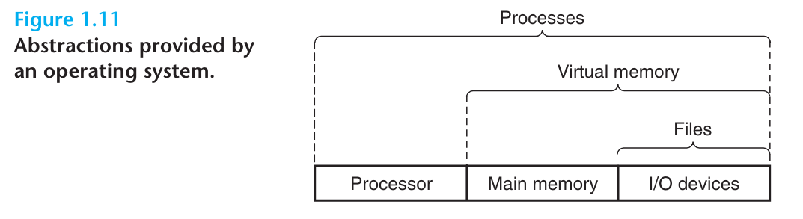
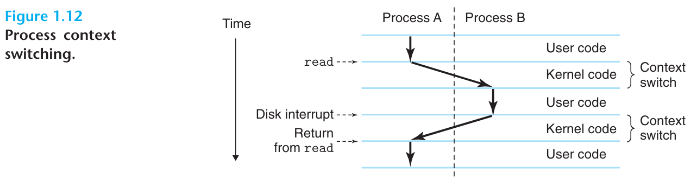

# 读书笔记

- 我们的应用程序并不直接访问硬件设备，而是通过操作系统提供的服务来间接访问它们。
- 我们可以把操作系统想象成是应用程序和硬件之间插入的一层软件。应用程序所有操作硬件的意图都需要通过操作系统实现。
- 操作系统有两个主要目标：（1）从失控程序的误用中保护硬件，（2）为应用程序提供简单且统一的机制，用于操作复杂且大不相同的基础硬件设备。
- 操作系统通过一些基本的抽象概念来同时完成上述两个目标：进程、虚拟内存和文件。文件是I/O设备的抽象，虚拟内存是内存和硬盘I/O设备的抽象，而进程则是处理器、内存和I/O设备的抽象。

## 1.7.1 Processes

- hello程序在现代系统中运行时，系统提供了一种只有hello程序在运行的假象。看起来hello程序独自占用着处理器、内存以及IO设备。处理器不受打断地执行着hello程序的每条指令，并且看起来整个内存中都只有hello程序的代码和数据。这种假象是由进程这种概念提供的，它是整个计算机科学里最重要也是最成功的想法。
- 进程是操作系统为运行程序做的抽象。
- 多个进程可以在同一个系统上并发的执行，并且每个进程都看似拥有独立的硬件使用权。

  - 并发，意味着不同进程的指令交替着执行。在大多数系统中，运行的线程数要远多于CPU的数量。
  - 传统的系统同一时间只能执行一个程序，更加先进的多核处理器系统则可以同时执行多个程序。
  - 在单核处理器系统上，处理器可以在多个进程间切换执行，以做到多进程并发执行。
  - 操作系统通过一种叫做上下文切换的机制，来实现进程的交替执行。

- 操作系统持续追踪着进程运行所需的状态信息。这些状态信息通常被称作上下文，上下文的内容包括：程序计数器的当前值、寄存器文件以及内存中的内容。

  - 在任何时间点，单核处理器系统都只能执行一个进程的代码。当操作系统决定将控制权交给新的进程时，它就会执行上下文切换，包括保存当前进程的上下文信息、恢复新进程的上下文并将控制权交给新进程。
  - 新的进程会从上次离开的地方继续往下执行。
  - 图1.12描绘了hello程序执行时系统上下文切换的场景。

- 在我们的示例场景中有两个并发执行的进程：shell进程以及hello进程。

  - 起初只有shell进程独自运行，等待着命令行输入。
  - 当我们要求shell执行hello程序时，shell通过调用称作系统调用的特殊函数来回应我们的请求，调用该函数会将控制权交给操作系统。
  - 接着操作系统保存了shell的上下文，然后创建新的hello进程以及新进程的上下文，并将控制权转交给新进程。
  - 当hello程序执行完毕后，操作系统又恢复了shell进程的上下文，shell又回到了它等待用户输入命令行的地方。

- 就像图1.12展示的那样，一个进程到另一个进程的转变是由操作系统内核管理的。

  - 内核是操作系统代码的一部分，它会一直存在于内存当中。
  - 当应用程序需要操作系统执行某些动作时，比如读或写文件，它会执行一个特殊的系统调用指令，将控制权转交给内核。内核会执行应用请求的动作，然后在执行结束后返回到应用程序的执行。
  - 注意，内核并不是一个独立的进程，相反，它是系统用于管理所有进程的代码和数据结构的集合体。

  实现进程这一概念，要求剥离与低级别硬件和操作系统软件的写作。我们会在第八章中探讨这是如何实现的，以及应用程序如何创建和控制属于它们自己的进程。

## 1.7.2 Threads

- 在现代系统中一个进程实际上可以拥有多个称作线程的控制单元。

  - 线程编程正因网络服务器对并发的需求而变得重要。线程间共享数据要比在进程间共享容易，同时线程通常比进程来得高效。
  - 多线程同时也是加快程序运行速度的一种手段。在1.9.2节中，我们会讨论这一点。
  - 在第十二章中，我们会学习并发性的概念，并学习多线程编程的方法。

## 1.7.3 Virtual Memory

- 虚拟内存是一种抽象，它为每个进程提供了一种独自使用内存的假象。每个进程都用相同统一的视角看待内存，这种视角通常称作虚拟地址空间。
  - 所有进程地址空间最顶部的区域都是为操作系统的数据和代码保留的。而在更低一些地址的区域则存储着用户进程的代码和数据。
  - 地址空间看起来由几片定义明确的区域组成，每块区域都有特定的用途：
    - 程序代码和数据。每个进程的代码都是从固定的地址开始存放的，紧跟着代码的数据区域对应着C中的全局变量。代码和数据区域是直接根据可执行文件初始化的。我们会在第七章学习链接和加载时更详细的介绍这部分地址空间的内容。
    - 堆。紧跟着代码和数据段的是运行时堆。堆不想代码和数据段那样在进程开始运行时就固定下大小，而是随着某些C标准库接口如malloc和free的调用而扩大或缩小。我们会在第九章学习虚拟内存管理时更详细的介绍这部分内容。
    - 共享库。在地址空间的中部区域存储着动态库的代码和数据，这些动态库包括C标准库、数学库等。共享库是一个强大但难懂的概念，我们会在第七章学习动态链接时介绍其是如何工作的。
    - 栈。在用户虚拟地址空间的顶部存储着用户栈，编译器使用 栈来实现函数调用。栈和堆很相像，会随着程序的执行动态的扩大和缩小。当程序调用函数时，栈会扩大，而程序从函数返回时，栈会缩小。我们会在第三章学习编译器是如何使用栈的。
    - 内核虚拟内存。地址空间的顶部区域是为内核保留的。应用程序不能读取或者写入这部分区域的内容，或是直接调用内核代码定义的函数。相反，它必须唤起内核来执行这些操作。
  - 虚拟内存的正常运作离不开硬件和操作系统软件的精密配合，其中包括处理器生成的每一个地址的硬件转换。一个基本的想法是将进程虚拟内存的内容存储在硬盘中，然后用内存充当硬盘的缓存。第九章解释了这是如何工作的，以及为何它对现代系统的运行如此重要。

## 1.7.4 Files

- 文件是一连串字节，仅此而已。所有的I/O设备，包括硬盘、键盘、显示器，甚至是网络，都可以套用文件这一模型。系统中所有的输入和输出都可以表现为文件的读取和写入，在程序中，我们可以用称作Unix I/O的小型系统调用集合来实现文件的读取写入功能。
  - 文件这一简单而又优雅的概念却有着十分强大的功能，因为它为程序提供了统一的视角来看待系统中所有可能存在的I/O设备。
  - 有了文件这一概念，应用程序员可以在不了解特定硬盘技术的情况下，操作硬盘中文件的内容。相同的程序可以运行在使用不同硬盘技术的系统上。

# 翻译

Back to our hello example. When the shell loaded and ran the hello program, and when the hello program printed its message, neither program accessed the keyboard, display, disk, or main memory directly. Rather, they relied on the services provided by the operating system. We can think of the operating system as a layer of software interposed between the application program and the hardware, as shown in Figure 1.10. All attempts by an application program to manipulate the hardware must go through the operating system.

回到我们的hello程序示例，当shell加载和运行hello程序，以及当hello程序打印信息时，程序本身没有直接访问键盘、显示器、硬盘或内存中的任何一个设备。相反，我们的程序是依靠着操作系统提供的服务来完成对硬件的访问的。我们可以把操作系统想象成是插入在应用程序和硬件系统之间的一层软件，就像图1.10展示的那样。应用程序所有的操作硬件的意图都需要经过操作系统。

The operating system has two primary purpose: (1) to protect the hardware from misuse by runaway applications and (2) to provide applications with simple and uniform mechanisms for manipulating complicated and often widely different low-level hardware devices. The operating system achieves both goals via the fundamental abstraction shown in Figure 1.11: processes, virtual memory, and files. As this figure suggests, files are abstractions for I/O devices, virtual memory is an abstraction for both the main memory and disk I/O devices, and processes are abstraction for the processor, main memory and I/O devices. We will discuss each in turn.

操作系统有两个主要目标：（1）从误用的失控进程手中保护硬件，（2）为应用程序提供简单且统一的机制，用于操作复杂且时常大不相同的基础硬件设备。操作系统通过图1.11所示的基本抽象来同时达成上述两个目标：进程、虚拟内存和文件。就像图中所展示的那样，文件是I/O设备的抽象，虚拟内存是内存和硬盘I/O设备的抽象，而进程则是处理器、内存和I/O设备三者的抽象。接下来我们会分别介绍它们。

## 1.7.1 Processes

When a program such as hello runs on modern system, the operating system provides the illusion that the program is the only one running on the system. The program appears to have exclusive use of both the processor, main memory, and I/O devices. The processor appears to execute the instruction in the program, one after the other, without interruption. And the code and data of the program appear to be the only objects in the system's memory. These illusions are provided by the notion of a process, one of the most important and successful ideas in computer science.

当类似hello这样的程序运行在系统中时，操作系统提供了一种只有这个程序运行在系统上的错觉。程序看起来单独使用着处理器、内存和I/O设备。处理器似乎不被打断地一条接着一条执行着程序中的指令。而程序的代码和数据看起来就像是系统内存中唯一的内容。这样的错觉是由进程这种概念提供的，而进程则是计算机科学中最重要也是最成功的想法。

A process is the operating system's abstraction for a running program. Multiple processes can run concurrently on the same system, and each process appear to have  exclusive use of the hardware. By concurrently, we mean that the instructions of one process are interleaved with the instructions  of another process. In most systems, there are more processes to run than there are CPUs to run them. Traditional systems could only execute one program at a time, while newer multi-core processors can execute several programs simultaneously. In either case, a single CPU can appear to execute multiple processes concurrently by having the processor switch among them. The operating system performs this interleaving with a mechanism known as context switching. To simplify the rest of this discussion, we consider only a uniprocessor system containing a single CPU. We will return to the discussion of multiprocessor system in Section 1.9.2.

进程是操作系统为运行程序提供的抽象。多个进程可以在同一个系统中并发地执行，并且每个进程都看起来单独使用着硬件。并发的意思是说不同进程的指令交错着执行。在大多数系统中，运行的进程数是要比处理器的数量多的。传统的系统一次只能运行一个程序，而更新的多核处理器则可以并行执行好几个程序。在前面的例子中，单核处理器可以通过在不同进程间切换，实现多个进程并发执行。操作系统通过名为**上下文切换**的机制来实现进程的交替执行。为了简化接下来的讨论，我们将只考虑一种只有一个处理器的单机系统。关于多处理器的系统我们会放在1.9.2节讨论。

The operating system keeps track of all the state information that the process needs in order to run. This state, which is known as the context, includes information such as current values of the PC, the register file, and the contents of main memory. At any point in time, a uniprocessor system can only execute the code for a single process, When the operating system decides to transfer control from the current process to some new process, it performs a context switch by saving the context of the current process, restoring the context of the new process, and then passing control to the new process. The new process picks up exactly where it left off. Figure 1.12 shows the basic idea for our example hello scenario.

操作系统持续追踪着进程运行所需的全部状态信息。这些状态信息通常被称为上下文（context），上下文的内容包括程序计数器的当前值、寄存器文件以及内存中的数据。一个单机系统在任何时间点都只能执行一个进程的代码。当操作系统决定将控制权从当前进程转交给新的进程时，它会首先执行上下文切换，也就是将当前进程的上下文保存起来，然后恢复新进程的上下文，然后将控制权交给新的进程。新的进程会从它离开的位置继续往下执行。图1.12描绘了我们调用hello程序时系统上下文切换的场景。

There are two concurrent processes in our example scenario: the shell process and the hello process. Initially, the shell process is running alone, waiting for input on the command line. When we ask it to run the hello program, the shell carries out our request by invoking a special function known as a *system call* that passes control to the operating system. The operating system saves the shell's context, creates a new hello process and its context, and then passes control to the new hello process. After hello terminates, the operating system restores the context of the shell program and passes control back to it, where it waits for the next command-line input.

在上面的场景中同时运行了两个进程：shell进程 和 hello进程。最开始只有shell进程在运行，等待着用户输入命令行。当我们请求它运行hello程序时，shell通过调用称作*系统调用*的特殊函数来执行这一请求，在调用该函数后，控制权会转交给操作系统。操作系统会保存shell进程的上下文，然后创建一个新的hello进程以及该进程的上下文，接着将控制权转交给新的hello进程。当hello程序执行完毕后，操作系统又会恢复shell进程的上下文，并将控制权交回给shell进程，shell进程又会继续等待下一条命令行输入。

As Figure 1.12 indicates, the transition from one process to another is managed by the operating system kernel. The kernel is the portion of the operating system code that is always resident in memory. When an application program requires some action by the operating system, such as to read or write a file, it executes a special system call instruction, transferring control to the kernel. The kernel then performs the requested operation and returns back to the application program. Note that the kernel is not a separate process. Instead, it is a collection of code and data structures that the system uses to manage all the processes.

就像图1.12展示的那样，一个进程到另一个进程的转变是由系统内核（kernel）管理的。内核是操作系统代码的一部分，这些代码会一直保留在内存当中。当应用程序需要操作系统执行一些动作时，例如读或者写一个文件，它会执行一个特殊的系统调用指令，将控制权转交给内核。接着内核会执行应用请求的操作，然后返回到应用程序的执行。注意，内核并不是一个独立的进程，相反，它是一系列代码和数据结构的集合，这些代码和数据结构则用来管理全部的进程。

Implementing the process abstraction requires close cooperation between both the low-level hardware and the operating system software. We will explore how this works, and how applications can create and control their own processes, in Chapter 8.

实现进程抽象要求剥离低级别硬件和操作系统软件之间的写作。我们会在第八章中探索这是如何实现的，以及应用程序如何创建和控制它们自己的进程。

## 1.7.2 Threads

Although we normally think of process as having a single control flow, in modern systems a process can actually consist of multiple execution units, called threads, each running in the context of the process and sharing the same code and global data. Threads are an increasingly important programming model because of the requirement for concurrency in network servers, because it is easier to share data between multiple threads than between multiple processes, and because threads are typically more efficient than processes. Multi-threading is also one way to make programs run faster when multiple processors are available, as we will discuss in Section 1.9.2. You will learn the basic concepts of concurrency, including how to write threaded programs, in Chapter 12.

尽管我们通常认为进程只有单一的控制流，但在现代系统中一个进程实际上可以包含多个称作线程的执行单元，每个线程都运行在进程的上下文中，它们彼此共享相同的代码和全局数据。线程这种编程模型正因为网络服务器的并发需求而逐渐变得重要，因为在线程间共享数据要比在进程间共享数据容易，同时也因为线程通常比进程要高效。多线程也是加快程序运行速度的一种方式，我们会在1.9.2节讨论这一话题。在第十二章中，我们会学习并发性的基础概念，包括如何写多线程程序。

##  1.7.3 Virtual Memory

Virtual memory is an abstraction that provides each process with the illusion that it has exclusive use of the main memory. Each process has the same uniform view of memory, which is  known as its virtual address space. The virtual address space for Linux processes is shown in Figure 1.13. (Other Unix systems use a similar layout.) In Linux, the topmost region of the address space is reserved for code and data in the operating system that is common to all processes. The lower region of the address space holds the code and data defined by the user's process. Note that addresses in the figure increase from the bottom to the top.

.png)

虚拟内存是一种抽象，它为每个进程提供了独自使用主存的假象。每个进程都有相同统一的看待内存的方式，通常称作虚拟地址空间。图1.13展示了Linux进程的虚拟地址空间（其它Unix系统也有着相同的布局）。在Linux中，地址最大的区域是为操作系统的代码和数据保留的，这一点对于所有进程都一样。地址更低的区域则用于存放用户进程定义的代码和数据。注意，在图1.3中地址值是自底向上递增的。

The virtual address space seen by each process consists of a number of well-defined areas, each with a specific purpose. You will learn more these areas later in the book, but it will be helpful to look briefly at each, starting with the lowest addresses and working our way up:

每个进程的虚拟地址空间看起来都有数个界限明确的区域组成，每个区域都有专门的用途。我们会在本书后面的内容详细介绍这些区域，但现在略微了解一下它们对我们也是有帮助的，让我们从地址最低的区域开始逐步向上介绍：

- Program code and data. Code begins at the same fixed address for all processes, followed by data locations that correspond to global C variables. The code and data areas are initialized directly from the contents of an executable object file--in our case, the hello executable. You will learn more about this part of the address space when we study linking and loading in Chapter 7.

- **程序代码和数据段**。所有进程的代码都存储在同一起始地址上，紧跟着代码的是对应着C全局变量的数据区域。代码和数据区域是直接根据可执行文件的内容初始化的，在我们的例子中是hello可执行程序。我们会在第七章介绍链接和加载时更细致地讲述这部分地址空间的内容。

- Heap. The code and data areas are followed immediately by the run-time heap. Unlike the code and data areas, which are fixed in size once the process begins running, the heap expands and contracts dynamically at run time as a result of calls to C standard library routines such as malloc and free. We will study heaps in detail when we learn about managing virtual memory in Chapter 9.

- **堆**。紧邻着代码和数据区域区域的是运行时堆。堆不像代码和数据区域那样在进程运行后大小便是固定的，它的大小会随着一些C标准库接口的调用而扩大或缩小，常见的接口如malloc和free。我们会在第九章学习虚拟内存管理时了解更多关于堆的细节。

- Shared libraries. Near the middle of the address space is an area that holds the code and data for shared libraries such as the C standard library and the math library. The notion of a shared library is a powerful but somewhat difficult concept. You will learn how they work when we study dynamic linking in Chapter 7.
- **共享库**。地址空间的中间区域存储着共享库的代码和数据。共享库的想法十分强大，但它同时又是有些难懂的概念。我们会在第七章学习动态链接时了解动态库是如何工作的。
- Stack. At the top of the user's virtual address space is the user stack that the compiler uses to implement function calls. Like the heap, the user stack expands and contracts dynamically during the execution of the program. In particular, each time we call a function, the stack grows. Each time we return from a function, it contracts. You will learn how the compiler uses the stack in Chapter 3.
- **栈**。虚拟地址空间的顶端用于存储用户栈，编译器将栈用于实现函数调用。用户栈和堆一样，会在程序运行的过程中动态的扩张和缩小：当我们调用函数时栈会增长，从函数返回时栈又会缩小。我们会在第三章学习编译器是如何使用栈的。
- Kernel virtual memory. The top region of the address space is reserved for the kernel. Application programs are not allowed to read or write the contents of this area or to directly call functions defined in the kernel code. Instead, they must invoke the kernel to perform these operations.
- **内核虚拟内存**。地址空间最顶部的区域是为内核保留的。应用程序无法读取或改写这部分区域的内容，也不能直接调用内核代码定义的函数。相反，应用程序必须唤起内核来执行这些操作。

For virtual memory to work, a sophisticated interaction is required between the hardware and the operating system software, including a hardware translation of every address generated by processor. The basic idea is to store the contents of a process's virtual memory on disk and then use the main memory as a cache for the disk. Chapter 9 explains how this works and why it is so important to the operation of modern systems.

为了使虚拟内存工作，操作系统软件和硬件间必须存在精密的合作，包括由处理器生成的所有地址的硬件转换。这其中基本的想法是将进程虚拟内存的内容存储在硬盘上，然后使用主存作为硬盘的缓存。第九章中解释了这是如何工作的，以及它为什么对现代系统的运行如此重要。

## 1.7.4 Files

A file is a sequence of bytes, nothing more and nothing less. Every I/O device, including disks, keyboards, displays, and even networks, is modeled as a file. All input and output in the system is performed by reading and writing files, using a small set of system calls known as Unix I/O.

文件是一连串字节，仅此而已。所有I/O设备，包括硬盘、键盘、显示器甚至是网络，都可以视作文件。系统中所有的输入和输出都表现为读取和写入文件，而文件的读取和写入是通过称作Unix I/O的小型系统调用集合实现的。

This simple and elegant notion of a file is nonetheless very powerful because it provides applications with a uniform view of all the varied I/O devices that might be contained in the system. For example, application programmers who manipulate the contents of a disk file are blissfully unaware of the specific disk technology. Further, the same program will run on different systems that use different disk technologies. You will learn about Unix I/O in Chapter 10.

文件这一简单而又优雅的概念有着十分强大的作用，因为它为应用程序提供了统一的视角来看待系统中可能存在的繁多的I/O设备。比如说，应用程序员可以不用了解特定的硬盘技术，就可以操作硬盘中的文件内容。更进一步，相同的程序可以运行在使用不同硬盘技术的不同系统上。你会在第十章学习Unix I/O。