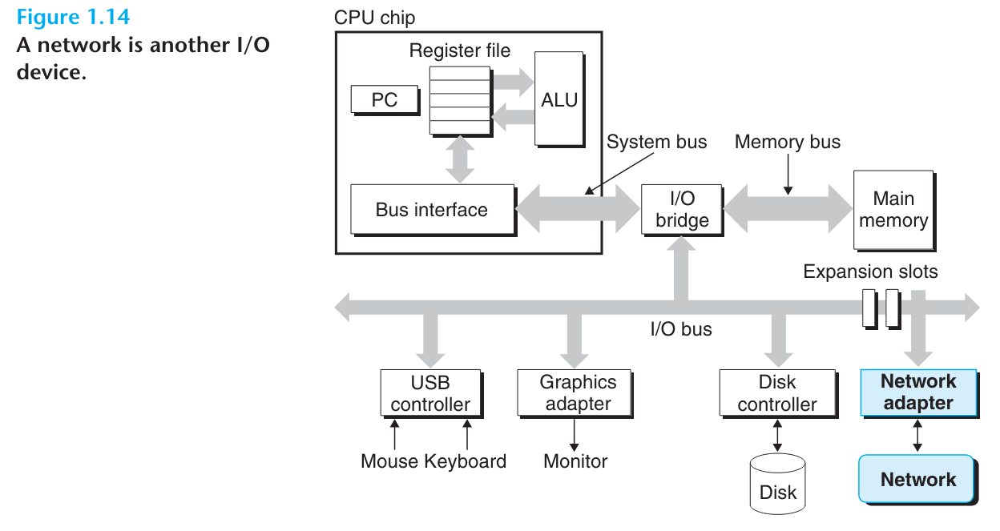
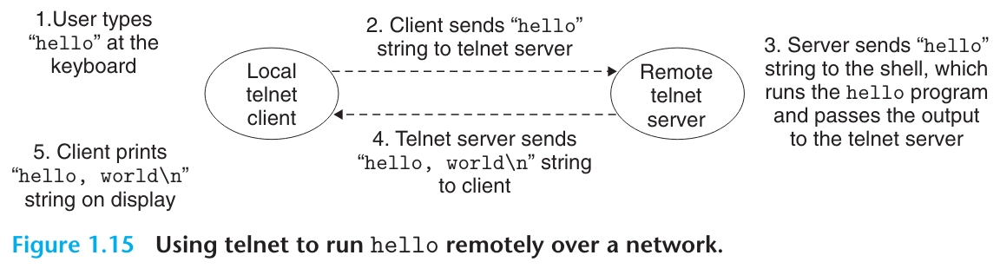

# 读书笔记

- 现代系统经常通过网络与其它系统连接。从独立的系统视角来看，网络可以被看成是另一种I/O设备，就像图1.14展示的那样。
  - 当系统从内存拷贝一连串字节到网卡，数据便会通过网络传输到另一台机器。就和把内存的数据写入硬盘一样。
  - 类似的系统可以读取其它机器发送的数据，并将数据写入内存。
- 随着因特网这样的全球网络诞生，从一台机器拷贝数据到另一台机器便成为了计算机系统最重要的用途。
  - 像是电子邮件、即使信息、万维网、FTP以及telnet这样的应用，都是基于网络传输数据的能力实现的。
- 通过使用telnet，我们可以在远程机器上运行hello程序。我们可以使用运行在本地的telnet客户端连接到远程机器上的telnet服务端。在我们登入远程机器并运行shell后，远程shell就会等待我们输入命令，从这时起，在远程机器上运行hello程序便包含了图1.15所示的五个基本步骤。
  - 在我们输入hello字符串并按下回车后，telnet客户端就会把这串字符串发送给服务端。
  - 服务端通过网络接收到字符串后，又会将字符串发给远程shell程序。
  - 接着远程shell运行hello程序并将结果输出给telnet服务端。
  - 最终telnet服务端将输出字符串通过网络发给客户端并由客户端将结果打印在我们的本地终端上。
- 上述基于客户端和服务端的数据交互是网络应用的经典样例。
- 在第11章，我们回学习如何构建自己的网络应用，以及如何利用这些知识来搭建我们自己的网页服务器。

# 翻译

Up to this point in our tour of systems, we have treated a system as an isolated collection of hardware and software. In practice, modern systems often linked to other systems by networks. From the point of view of an individual system, the network can be viewed as just another I/O device, as shown in Figure 1.14. When the system copies a sequence of bytes from main memory to the network adapter, the data flow across the network to another machine, instead of, say, to a local disk drive. Similarly, the system can read data sent from other machines and copy these data to its main memory.

我们的计算机系统之旅到目前为止，都将系统当作是硬件和软件集合在一起的孤岛。但在现实中，计算机系统常常通过网络与其它系统连接。从一个单独的系统视角来看，网络可以视作是另一种I/O设备，就像图1.14展示的那样。当系统将一连串字节数据从内存拷贝到网络适配器，数据便通过网络流向另一台机器，这与把数据写到硬盘中是类似的。同样的，计算机系统也可以读取其它机器发送的数据，并将接收到的数据拷贝到内存中。

With the advent of global network such as the Internet, copying information from one machine to another has become one of the most important uses of computer systems. For example, applications such as email, instant messaging, the World Wide Web, FTP, and telnet are all based on the ability to copy information over a network.

随着互联网这样的全球网络诞生，从一台机器拷贝信息到另一台，便成为了计算机系统最重要的用途。举例来说，像是电子邮件、即使信息、万维网、FTP和telnet这些应用都是基于网络拷贝数据的功能实现的。

Returning to our hello example, we could use the familiar telnet application to run hello on a remote machine. Suppose we use a telnet client running on our local machine to connect to a telnet server on a remote machine. After we log in to the remote machine and run a shell, the remote shell is waiting to receive an input command. From this point, running the hello program remotely involves the five basic steps shown in Figure 1.15.

回到我们到hello示例，我们可以使用常见的telnet应用来在远程机器上运行hello程序。假设我们使用运行在本地机器上的telnet客户端来连接远程机器上的telnet服务端。在我们登入远程机器并运行shell后，远程shell便会等待命令输入。从这里开始，在远程机器上运行hello程序包含了图1.15所示的5个基本步骤。

After we type in the hello string to the telnet client and hit the enter key, the client sends the string to the telnet server. After the telnet server receives the string from the network, it passes it along to the remote shell program. Next, the remote shell runs the hello program and passes the output line back to the telnet server. Finally, the telnet server forwards the output string across the network to the telnet client, which prints the output string on our local terminal.

当我们在telnet客户端上输入hello字符串并按下回车键后，客户端便会将字符串发送给服务端。接着telnet服务端从网络接收到字符串，并将字符串传递给远程shell程序。接下来，远程shell会运行hello程序，并将输出行传递回telnet服务端。最终telnet服务端通过网络将输出字符串发回telnet客户端，并最终显示在我们的终端上。

This type of exchange between client and servers is typical of all network applications. In Chapter 11 you will learn how to build network applications and apply this knowledge to build a simple Web server.

这样的数据交换是网络应用的一个典型范例。在第11章中，你会学习如何构建网络应用，并利用这些知识来搭建其一个简单的网页服务器。
