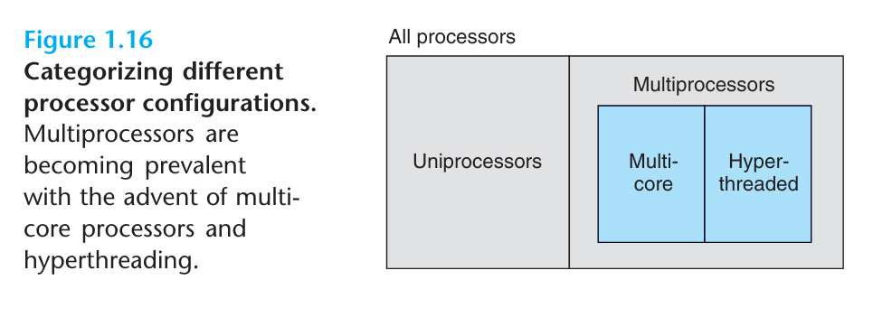
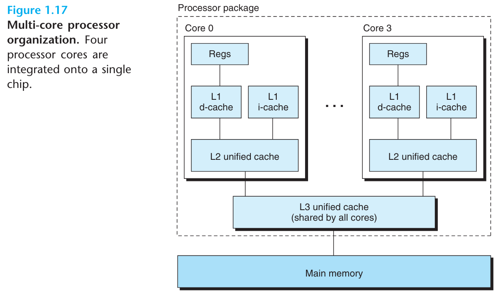
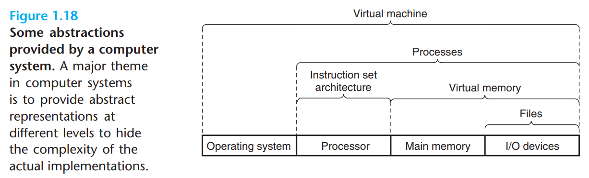

#  笔记

- 是时候结束我们匆忙的计算机系统之旅了。从这次的旅途中我们得出的一个重要结论是，系统不仅仅是单纯的硬件，它是硬件和系统软件纠缠的集合。系统硬件和软件必须相互协作才能达成运行应用的壮举。本书的剩余部分会介绍硬件和软件的详细细节，并且会向你展示如何利用这些知识来写出更快、更可靠和更安全的程序。
- 在本章的末尾，我们将介绍几个贯穿整个计算机系统的重要概念。我们会在本书的多个地方讨论这些概念的重要性。

## 1.9.1 Amdahl's Law

- 吉姆阿姆达尔，一位计算学早期的开拓者。他对提高系统中一部分性能对整体性能的提高效果做了一个简单但富有洞察力的总结：当我们优化系统某一部分的性能时，这种优化对于系统整体性能的提升程度取决于优化的部分占比有多大，以及优化的程度有多深。这个总结被称为阿姆达尔定律。
  - 考虑一个运行某个应用需要花费${T_{old}}$时间的系统。假设系统的某部分耗时占总体的比例为$\alpha$，这部分系统优化的程度记作系数$k$。则这部分系统原本的耗时为$\alpha T_{old}$，优化后的耗时为$\alpha T_{old}/k$，则整个系统的耗时可以计算为$T_{new}=(1-\alpha)T_{old}+(\alpha T_{old})/k=T_{old}[(1-\alpha)+\alpha/k]$。从这里我们可以计算得到优化的程度$S=T_{old}/T_{new}$为$\frac{1}{(1-\alpha)+\alpha/k}$。
- 作为示例，考虑系统中某部分耗时占比为60%（$\alpha=0.6$），这部分优化的系数为3（$k=3$），则系统整体的性能提升为$1/[0.4+0.6/3]=1.67\times$​。尽管我们对系统的主要部分做了巨大的优化，但这种优化对于系统整体性能的提升仍然是轻微的。这便是阿姆达尔定律的核心思想，如果想要显著提升系统的整体性能，我们必须对这个系统的相当大一部分做优化。
  - 一个阿姆达尔定律的有趣特例是将优化系数设为$\infin$（无穷）。如此我们就能将系统某个部分的耗时降低到微乎其微的程度，于是我们就能计算得到$S_\infin=\frac{1}{1-\alpha}$。在这个特例中，如果我们能将系统60%的耗时优化到近乎为0，则我们对系统整体性能的提升程度为$1/0.4=2.5\times$。
- 阿姆达尔定律描述了优化任何事物的准则。除了应用在计算机系统，它还可以指导公司降低制造剃须刀的成本，以及指导一个学生如何提高他/她的绩点。也许这个准则最有意义的用途还是在计算机的世界，在这个世界中性能提高两倍甚至更多都是家常便饭。如此高的优化系数只有通过优化系统的大部分性能才能达到。

## 1.9.2 Concurrency and Parallelism

- 纵观整个数字计算机的历史，两个需求恒久推动着计算机性能的提高：我们想要计算机做得更多、跑得更快。在计算机能同时做更多事情时，这两个要求都会得到满足。我们用并发这一词汇描述系统同时执行多个任务，并且用并行描述系统利用并发运行得更快。并行可以应用在多个不同的计算机抽象层级。我们将按计算机层级从高到低分别介绍三种不同的并发应用。

### Thread-Level Concurrency

- 基于进程抽象，我们可以创造一个可以实现并发的系统，这个系统中可以有多个程序同时运行。引入线程概念，我们甚至可以在单个进程里面拥有多条控制流。
- 自二十世纪六十年代**分时**技术出现以来，计算机便开始支持同时运行多个程序了。
  - 通常来讲，这种同时运行多个程序的现象是模拟出来的，计算机通过频繁切换执行进程，来制造多个程序同时运行的假象，就像是马戏团表演人员不停的抛出和接住空中的球。
  - 这种形式的并发允许多个用户同时与一台计算机交互，比如同时有很多人从网页服务器获取网页。
  - 它同时也允许一个用户执行多个应用，比如在一个窗口中打开网页浏览器，在另一个窗口打开文字处理器，同时又有流媒体音乐在播放。
- 直到最近，大多数计算任务都是由一个处理器完成的，尽管处理器需要在很多任务间切换执行。这种配置被称作单处理器系统。
- 当我们构建一个由多个处理器组成，并且所有处理器都由一个运行系统内核控制的计算机，我们便得到了多处理器系统。这样的系统在二十世纪80年代的超级计算机上便已经实现，但直到最近多核处理器和超线程的出现，多处理器系统才逐渐普及。图1.16展示了不同处理器类型的分类。
- 多核处理器会在一个集成电路芯片上集成多个CPU。图1.17描绘了经典多核处理器的组织架构。
  - 图中，多核处理器有4个CPU核心，每个核心都有单独的L1和L2缓存，并且每个L1缓存都被分为了两部分--一部分负责持有最近获取的指令，而另一个则负责存储数据。
  - 所有核心共享更高级别的L3缓存，这个缓存作为内存数据的访问入口使用。
  - 制造业专家预测，将来的处理器将会有成百上千个核心集成在一块芯片上。
- 超线程，同时又被称作同时多线程，是一种允许一个CPU执行多条控制流的技术。超线程中部分CPU硬件会有多个备份，比如程序计数器和寄存器文件，同时部分硬件又只有一个备份，比如用于执行浮点运算的单元。
  - 然而，一个传统的处理器需要花费2万个时钟周期来切换不同的线程。而一个超线程处理器则可以逐周期决定要执行哪个线程。
  - 超线程允许CPU充分发挥处理资源的优势。比方说，如果一个线程必须等待某些数据加载进缓存，则CPU此时可以执行其它线程。
  - 作为示例，英特尔i7处理器每个核可以执行两个线程，所以4核系统实际可以并行运行8个线程。
- 使用多核处理器有两个途径可以提高系统性能。
  - 首先，它减少了多个任务同时运行时，模拟并发的开销。正如前面提到的，即使是只有一个用户的个人电脑，也会同时有多个任务在同时进行。
  - 其次，它可以使应用程序跑得更快，但仅限在程序充分利用多线程并行加速的情况。
- 因此，尽管并发这一原则已经被提出和研究了超过50年，直到多核处理器和超线程系统出现，人们渴望找到方法写出利用硬件实现线程级并行的需求才明显提高。
- 第12章会更详细介绍并发，以及如何使用并发来共享计算资源，还有如何允许程序更并行地执行。

### Instruction-Level Parallelism

- 在更低的抽象层级，现代处理器可以同时运行多条指令，这一特性被称作指令级并行。
  - 举例来讲，早期的微处理器，比如1978年发行的Intel 8086芯片，需要多个（通常是3到10个）时钟周期来执行一条指令。最近发行的处理器则可以维持每时钟2-4条指令的执行速率。
  - 当所有指令都要求更长的执行时间，比如20个周期甚至更常的情况下，处理器通过数条聪明的技巧来同时处理数百条指令。
  - 在第四章，我们会介绍管道的使用，在管道中，所有要求执行的指令都会被分成不同的步骤，分配给不同的处理器硬件处理。这些处理器硬件可以并行运行，以处理不同指令的不同部分。
  - 我们还会看到一个极其简单的硬件设计，它可以达到每时钟1条执行的执行速率。
- 能维持每时钟超过1条指令执行速率的处理器被称作超标量处理器。大多数现代处理器支持超标量运行。在第五章，我们会将这些处理器抽象为一个高级模型。我们会直到作为应用程序员如何通过这个模型理解程序的性能。他们可以借助这些知识让基于程序生成的代码达到更高级别的指令并行，同时让程序的性能变得更高。

### Single-Instruction, Multiple-Data (SIMD) Parallelism

- 在最低的层级上，许多现代处理器有特殊的硬件允许一条指令引起多个并行操作，其中一种为人熟知的模式是单指令多数据（SIMD）并行。
  - 距离来将，最近几代Intel和AMD处理器有指令可以并行处理8对单精度浮点数据（C语言的float型变量）的加法运算。
- 这些SIMD指令主要用于如图像、音频和视频数据的加速运算。尽管一些编译器试图提取出C程序中可以用SIMD加速的部分，但一种更为可靠的方法是：使用编译器如GCC提供的特殊的vector数据类型来编写程序。我们在网页旁注OPT:SIMD中描述了这种编程风格，作为第五章程序优化内容的补充。

## 1.9.3 The Importance of Abstractions in Computer Systems

- 抽象是计算机科学中最重要的概念。
  - 比方说，一种好的编程实践是为一系列函数提供一个简单的应用程序入口（API），这样其它程序员不同深入了解代码的工作原理，也能使用这段代码。
  - 不同的编程语言提供不同形式、不同级别的抽象，比如Java的类声明和C的函数原型。
- 我们已经介绍的几种计算机系统中的抽象。
  - 指令集提供了处理器的抽象，在这种抽象下，机器代码运行起来就像是指令被一条条执行。而处理器的底层硬件则要复杂得多，它需要并行指令多条执行，并且每条指令执行都遵循简单、有序的模式。通过保持相同的执行模式，不同的处理器可以执行相同的机器代码，并提供不同的成本和性能表现。
  - 而对于操作系统，我们介绍了三种抽象：文件、虚拟内存和进程，它们分别是I/O设备、程序内存和运行程序的抽象。
  - 这里我们引入一个新的抽象：虚拟机。虚拟机提供了整个计算机的抽象，包括操作系统、处理器和程序。虚拟机最早在1960年代由IBM提出，但这一概念直到最近才因为计算机管理而变得重要，这些计算机通常用于执行为不同操作系统设计的程序，或为同一系统的不同版本设计的程序，这些操作系统包括有微软Windows、Mac OS X和Linux。
  - 我们会在稍后的段落重新介绍这些抽象。

# 翻译

This concludes our initial whirlwind tour of systems. An important idea to take away from this discussion is that a system is more than just hardware. It is a collection of intertwined hardware and systems software that must cooperate in order to achieve the ultimate goal of running application programs. The rest of this book will fill in some details about the hardware and the software, and it will show how, by knowing these details, you can write programs that are faster, more reliable, and more secure.

我们匆忙的系统之旅到这里就差不多结束了。我们从上面的讨论中得出的一条重要结论是：系统不仅仅是硬件，它是硬件和系统软件纠缠在一起的集合体，它们共同协作才能达成运行应用程序这样的伟大目标。本书接下来的内容会介绍更多关于硬件和软件的细节，并且向你展示如何应用这些知识来写出更快、更可靠以及更安全的程序。

To close out this chapter, we highlight several important concepts that cut across all aspects of computer systems. We will discuss the importance of these concepts at multiple places within the book.

为了结束这一章节，我们了几挑出个贯穿计算机系统的重要概念。我们会在本书的多个地方讨论这些概念的重要性。

##  1.9.1 Amdahl's Law

Gene Amdahl, one of the early pioneers in computing, made a simple but insightful observation about the effectiveness of improving the performance of one part of a system. This observation has come to be known as Amdahl's law. The main idea is that when we speed up one part of a system, the effect on the overall system performance depends on both how significant this part was and how much it sped up. Consider a system in which executing some application requires time $T_{old}$. Suppose some part of the system requires a fraction $\alpha$ of this time, and that we improve its performance by a factor of k. That is, the component originally required time $\alpha T_{old}$, and it now requires time $(\alpha T_{old})/k$. The overall execution time would thus be
$$
T_{new}=(1-\alpha)T_{old}+(\alpha T_{old})/k
\\=T_{old}[(1-\alpha)+\alpha/k]
$$
From this, we can compute the speedup $S=T_{old}/T_{new}$ as
$$
S=\frac{1}{(1-\alpha)+\alpha/k}
$$
吉姆阿姆达尔，一位计算学早期的开拓者，他总结了关于优化系统部分性能对于系统整体性能的提升效果的规律，这种规律也被称作阿姆达尔定律。该定律的主要思想是，优化系统一部分性能对于系统整体性能的提升效果，取决于优化的部分在系统中的占比以及这部分性能优化的程度。考虑一个在系统中运行的应用程序，该程序原本的执行时间为$T_{old}$。假设该程序某个部分的耗时占整个程序的比例为$\alpha$，并且我们将这部分程序的耗时降低了k倍，那么这部分程序原本的耗时为$\alpha T_{old}$，优化过后的耗时则是$(\alpha T_{old})/k$，则程序整体的运行时间为：
$$
T_{new}=(1-\alpha)T_{old}+(\alpha T_{old})/k
\\=T_{old}[(1-\alpha)+\alpha/k]
$$
接着我们便可以得出程序整体的性能提升$S=T_{old}/T_{new}$为
$$
S=\frac{1}{(1-\alpha)+\alpha/k}
$$
As an example, consider the case where a part of the system that initially consumed 60% of the time ($\alpha=0.6$) is sped up by a factor of 3 ($k=3$). Then we get a speedup of $1/[0.4 + 0.6/3]=1.67\times$. Even though we made a substantial improvement to a major part of system, our net speedup was significantly less than the speedup for the one part. This is the major insight of Amdahl's law -- to significantly speed up the entire system, we must improve the speed of a very large fraction of the overall system.

作为示例，考虑一个程序，该程序的一部分占整个程序耗时的60%（$\alpha=0.6$），我们将该部分的耗时降低了三倍（$k=3$），这样我们就能计算得到程序整体性能提升为$1/[0.4 + 0.6/3]=1.67\times$。尽管我们显著优化了程序中耗时占比较大的部分，但这种优化对于程序整体性能提升来说仍然是轻微的。这揭示了阿姆达尔定律的主要思想--为了显著提升程序整体性能，我们必须着重优化其中耗时占比非常大的部分。

One interesting special case of Amdahl's law is to consider the effect of setting k to $\infin$. That is, we are able to take some part of the system and speed it up to the point at which it takes a negligible amount of time. We then get
$$
S_{\infin}=\frac{1}{(1-\alpha)}
$$
So, for example, if we can speed up 60% of the system to the point where it requires close to no time, our net speedup will still only be $1/0.4 = 2.5\times$.

阿姆达尔定律的一个有趣的特例是将优化的倍数k设定为无限$\infin$。这意味着我们将程序的一部分耗时减少到了微乎其微的程度，于是我们就能得到优化程度：
$$
S_{\infin}=\frac{1}{(1-\alpha)}
$$
举例来说，如果我们将程序60%的耗时优化到了几乎可以不计的程度，程序整体的性能提升仍然只有$1/0.4 = 2.5\times$。

Amdahl's law describes a general principle for improving any process. In addition to its application to speeding up computer systems, it can guide a company trying to reduce the cost of manufacturing razor blades, or a student trying to improve his or her grade point average. Perhaps it is most meaningful in the world of computers, where we routinely improve performance by factors of 2 or more. Such high factors can only be achieved by optimizing large parts of system.

阿姆达尔定律描述了优化任何过程的准则。除了用于提速计算机系统之外，它也可以指导一个尝试减少剃须刀成本的公司，也可以帮助一个想要提高自己绩点的学生。也许这个法则最大的用处就在计算机世界，一个常常需要将性能提升2倍甚至更多的世界。如此大的提升只能通过优化计算系统的大部分来达成。

## 1.9.2 Concurrency and Parallelism

Throughout the history of digital computers, two demands have been constant forces in driving improvements: we want them to do more, and we want them to run faster. Both of these factors improve when the processor does more things at once. We use the term concurrency to refer to the general concept of a system with multiple, simultaneous activities, and the term parallelism to refer to the use of concurrency to make a system run faster. We highlight three levels here, working from the highest to the lowest level in the system hierarchy.

回顾整个数字计算机的历史，有两个要求恒久的推动着计算机的进步：我们想要让计算机做更多事情、以及让计算机运行得更快。这两个要求在计算机能一次做多件事情的时候能够同时达成。我们使用术语并发来描述系统同时执行多个活动，用并行来描述系统利用并发运行得更快。在这里我们将划分三个层级介绍并发和并行，并将从高层级的抽象开始逐步向系统底层介绍。

### Thread-Level Concurrency

Building on the process abstraction, we are able to devise systems where multiple programs execute at the same time, leading to concurrency. With threads, we can even have multiple control flows executing within a single process. Support for concurrent execution has been found in computer systems since the advent of time-sharing in the early 1960s. Traditionally, this concurrent execution was only simulated, by having a single computer rapidly switch among its executing processes, much as a juggler keeps multiple balls flying through the air. This form of concurrency allows multiple users to interact with a system at the same time, such as when many people want to get pages from a single Web server. It also allows a single user to engage in multiple tasks concurrently, such as having a Web browser in one window, a word processor in another, and streaming music playing at the same time. Until recently, most actual computing was done by a single processor, even if that processor had to switch among multiple tasks. This configuration is known as a uniprocessor system.

基于进程这一抽象，我们可以设计一个能够同时运行多个程序的系统，实现并发。而基于线程，我们甚至可以在一个进程里面拥有多个控制流。计算机系统对于并发执行的支持最早可以追溯到20世纪60年代，分时概念的出现使得并发成为可能。通常，这种并发执行是通过处理器在多个执行进程间频繁切换模拟出来的，就像一个马戏表演者不断接住和抛出空中的球。这种形式的并发允许多个用户同时于系统进行交互，比如许多用户想从网页服务器获取页面。它也允许一个用户并发地使用多个任务，比如在一个窗口中打开网页浏览器，在另一个窗口打开word文档，同时又在播放流媒体音乐。直到最近，大多数实际的计算都是由单个处理器完成的，即使处理器需要在多个任务间切换。这种配置通常被称作单处理器系统。

When we construct a system consisting of multiple processors all under the control of a single operating system kernel, we have a multiprocessor system. Such systems have been available for lager-scale computing since the 1980s, but they have more recently become commonplace with the advent of multi-core processors and hyperthreading. Figure 1.16 shows a taxonomy of these different processor types.

当我们构建起一个由单个操作系统内核管理的、包含多个处理器的系统，我们便得到了多处理器系统。这样的系统在20世纪80年代便已经在大型计算机上实现了，但直到最近随着多核处理器和超线程的出现，这种多核处理器系统才变得普遍。图1.16展示了不同处理器类型的分类。

Multi-core processors have several CPUs (referred to as "cores") integrated on to a single integrated-circuit chip. Figure 1.17 illustrates the organization of a typical multi-core processor, where the chip has four CPU cores, each with its own L1 and L2 caches, and with each L1 cache split into two parts--one to hold recently fetched instructions and one to hold data. The cores share higher levels of cache as well as the interface to main memory. Industry experts predict that they will be able to have dozens, and ultimately hundreds, of cores on a single chip.

多核处理器有多个CPU（也称作核）集成在同一块集成电路芯片上。图1.17展示了经典多核处理器的架构，在图中有4个CPU核，每一个核心都有独立的L1和L2缓存，并且每个L1缓存都被分为了两部分--一部分用于存储最近获取的指令，而另一部分则存储数据。每个核心共享更高级别的作为内存入口的缓存。制造业专家们预测他们将来会有数十甚至数百个核心集成在同一块芯片上。

Hyperthreading, sometimes called simultaneous multi-threading, is a technique that allows a single CPU to execute multiple flows of control. It involves having multiple copies of some of the CPU hardware, such as program counters and register files, while having only single copies of of other parts of the hardware, such as the units that perform floating-point arithmetic. Whereas a conventional processor requires around 20,000 clock cycles to shift between different threads, a hyperthreaded processor decides which of its threads to execute on a cycle-by-cycle basis. It enables the CPU to take better advantage of its processing resources. For example, if one thread must wait for some data to be loaded into a cache, the CPU can proceed with the execution of a different thread. As an example, the Intel Core i7 processor can have each core executing two threads, and so a four-core system can actually execute eight threads in parallel.

超线程，有时也称作同时多线程，它是一种允许CPU执行多个控制流的技术。超线程中，部分CPU硬件拥有多个副本，比如拥有多个程序计数器和寄存器文件，但同时有些CPU硬件又只有单独一份，比如用于浮点数运算的计算单元。然而，传统的CPU需要花费2万个时钟周期在不同线程间切换，而超线程处理器可以逐周期决定执行哪个线程，这允许CPU在资源调度上发挥更大的优势。比如，当一个线程必须等待数据加载到缓存中时，CPU就可以继续执行另一个线程。作为例子，英特尔i7处理器允许单个核心执行两个线程，所以4核处理器系统同时可以执行8个线程。

The use of multiprocessing can improve system performance in two ways. First, it reduces the need to simulate concurrency when performing multiple tasks. As mentioned, even a personal computer being used by a single person is expected to perform many activities concurrently. Second, it can run a single application program faster, but only if that program is expressed in terms of multiple threads that can effectively execute in parallel. Thus, although the principle of concurrency have been formulated and studied for over 50 years, the advent of multi-core and hyperthreaded systems has greatly increased the desire to find ways to write application programs that can exploit the thread-level parallelism available with the hardware. Chapter 12 will look much more deeply into concurrency and its use to provide a sharing of processing resources and to provide a sharing of processing resources and to enable more parallelism in program execution.

多进程有两种方式可以提高系统性能。首先，它减少了系统模拟并发的需求。正如上文提到的，即使是个人电脑，也有许多任务在同时执行。其次，它可以让单个应用程序跑得更快，但前提是程序有效利用了多线程实现并行执行。所以，尽管并发这一概念提出并研究了超过50年，一直到多核和超线程出现，人们才逐步开始探索如何写出可以利用硬件实现线程级并行的程序。第十二章会更全面地介绍并发，以及如何利用并发共享运算资源，还有如何让更多的程序并行执行。

### Instruction-Level Parallelism

At a much lower level of abstraction, modern processors can execute multiple instructions at one time, a property known as instruction-level parallelism. For example, early microprocessors, such as the 1978-vintage Intel 8086, required multiple (typically 3-10) clock cycles to execute a single instruction. More recent processors can sustain execution rates of 2-4 instructions per clock cycle. Any given instruction requires much longer from start to finish, perhaps 20 cycles or more, but the processor uses a number of clever tricks to process as many as 100 instructions at a time. In Chapter 4, we will explore the use of pipelining, where the actions required to execute an instruction are partitioned into different steps and the processor hardware is organized as a series of stages, each performing one of these steps. The stages can operate in parallel, working on different parts of different instructions. We will see that a fairly simple hardware design can sustain an execution rate close to 1 instruction per clock cycle.

在更基础的抽象中，现代处理器同时可以执行多条指令，这一功能被称作指令级并行。举例来说，早期的微处理器，如1978年的Intel 8086，执行单条指令需要花费多个时钟周期（通常是3-10个）。而现代的处理器，则可以维持每时钟2-4条指令的执行速率。在所有指令的执行时间都变长的前提下（20个时钟周期甚至更多），现代处理器利用了多个聪明的技巧来尽可能多的增加同时执行的指令数量。在第四章，我们会介绍指令流水线，它会将执行一条指令的动作分成多个不同的步骤，同时将处理器硬件组织成一系列不同的模块，每个模块用于处理相应的步骤。处理器中这些不同的模块可以并行运行，分别用于处理不同指令的不同部分。我们会见到一个相当简单的硬件设计，它可以维持接近每时钟1条指令的执行速率。

Processors that can sustain execution rates faster than 1 instruction per cycle are known as superscalar processors. Most modern processors support superscalar operation. In Chapter 5, we will describe a high-level model of such processors. We will see that application programmers can use this model to understand the performance of their programs. They can then write programs such that the generated code achieves higher degrees of instruction-level parallelism and therefore runs faster.

可以维持每时钟1条指令以上执行速率的处理器，被称作超标量处理器。大多数现代处理器都支持超标量运行。在第五章，我们会提出一个超标量处理器的高级模型，应用程序员可以借助这个模型来理解他们程序的性能表现。程序员可以借助这些知识，来使他们写出的代码能更大程度利用指令级并行，以使程序跑得更快。

### Single-Instruction, Multiple-Data (SIMD) Parallelism

At the lowest level, many modern processors have special hardware that allows a single instruction to cause multiple operations to be performed in parallel, a mode known as single-instruction, multiple-data (SIMD) parallelism. For example, recent generations of Intel and AMD processors have instructions that can add 8 pairs of single-precision floating-point numbers (C data type float) in parallel.

在最基础的层级，许多现代处理器有特殊的硬件允许一条指令并行执行多个操作，其中一种为人熟知的模式称作单指令多数据（SIMD）。比方说，最近几代Intel和AMD处理器有一条指令可以并行完成8对单精度浮点数（C中的float型变量）相加。

These SIMD instructions are provided mostly to speed up applications that process image, sound, and video data. Although some compilers attempt to automatically extract SIMD parallelism from C programs, a more reliable method is to write programs using special vector data types supported in compilers such as GCC. We describe this style of programming in Web Aside OPT:SIMD, as a supplement to the more general presentation on program optimization found in Chapter 5.

这些SIMD指令通常用于提高程序处理图片、音频和视频时的性能。尽管一些编译器尝试自动从C程序中提炼SIMD并行的部分，但更靠的实现方法是使用编译器提供的vector数据类型进行编程。我们会在网页旁注OPT:SIMD中描述这种风格的编程，作为第五章程序优化的更为通用的内容展示的补充。

## 1.9.3 The Importance of Abstractions in Computer Systems

The use of abstractions is one of the most important concepts in computer science. For example, on aspect of good programming practice is to formulate a simple application program interface (API) for a set of functions that allow programmers to use the code without to delve into its inner workings. Different programing languages provide different forms and levels of support for abstraction, such as Java class declarations and C function prototypes.

在计算机科学中抽象是最为重要的概念。比方说，一种好的编程实践是为一系列函数制定一个简单的应用程序入口（API），这样程序员不用了解内部实现也可以上手使用这段代码。不同编程语言提供了不同形式、不同等级的抽象支持，比如Java的类声明和C的函数原型。

We have already been introduced to several of the abstractions seen in computer systems, as indicated in Figure 1.18. On the processor side, the *instruction set architecture* provides an abstractions of the actual processor hardware. With this abstraction, a machine-code behaves as if it were executed on a processor that performs just one instruction at a time. The underlying hardware is far more elaborate, executing multiple instructions in parallel, but always in a way that consistent with the simple, sequential model. By keeping the same execution model, different processor implementations can execute the same machine code while offering a range of cost and performance.

我们已经介绍了几种计算机系统的抽象，就如同图1.18展示的那样。在处理器端，指令集架构提供了处理器硬件的抽象，在这种抽象的帮助下，机器指令代码的执行，就可以看作是同一时间只有一条指令在执行。在底层硬件实现，指令的执行复杂得多，多条指令会并行执行，但始终保持着简单、有序的方式运行。通过保持相同的执行模式，不同的处理器实现可以执行相同的机器代码，同时提供出一系列不同的成本和性能。

On the operating system side, we have introduced three abstractions: files as an abstraction of I/O devices, virtual memory as an abstraction of program memory, and processes as an abstraction of a running program. To these abstractions we add a new one: the virtual machine, proving an abstraction of the entire computer, including the operating system, the processor, and the programs. The idea of a virtual machine was introduced by IBM in the 1960s, but it has become more prominent recently as a way to manage computers that must be able to run programs designed for multiple operating systems (such as Microsoft Windows, Mac OS X, and Linux) or different versions of the same operating system.

对于操作系统，我们介绍了三种抽象：文件作为I/O设备的抽象，虚拟内存作为程序内存的抽象，以及进程作为运行程序的抽象。在这里我们引入一个新的抽象：虚拟机，它提供整个计算机的抽象，包含操作系统、处理器和程序。虚拟机的概念最早由IBM在1960年代提出，直到最近它才作为管理不同计算机的方法变得重要起来，这些计算机通常用来跑为多种操作系统设计的程序，或是跑为同一操作系统的不同版本设计的程序（这些操作系统包括微软Windows、MAC OS X和Linux）。

We will return to these abstractions in subsequent sections of the book.

我们会在随后的段落中重新介绍这些抽象。

# 问题

## 1.9.1 Amdahl's Law

### Problem 1.1

假设你是一个卡车司机，你需要运送一批土豆从爱达荷州前往明尼苏达州，这段旅程全程2,500公里，你预估在限速下的平均车速为100 km/hr，跑完整段路程需要25小时。

A. 通过新闻你了解到蒙大拿州刚刚废除了车辆限速，解除限速的路程有1,500公里。你的卡车在这段路程的速度可以达到150 km/hr。那么你的整段路程会提速多少？
$$
\alpha=1500/2500=0.6
\\k=150/100=1.5
\\S=\frac{1}{(1-\alpha)+\alpha/k}=\frac{1}{0.4+0.6/1.5}=1.25\times
$$
B. 你可以在www.fasttrucks.com上为你的卡车购买新的涡轮增压器，他们提供了多种选择，但性能更好的种类需要花费更多的价格。如果你想要蒙大拿州段将整段路程提升1.67倍的速度，你需要将卡车升级到多快的速度？
$$
k=\frac{\alpha}{1/S-1+\alpha}=\frac{0.6}{1/1.67-1+0.6}=3.018
\\x=100\times k=301.8km/hr
$$

### Problem 1.2

有一家汽车制造公司向他们的谷歌承诺，下一款发布的引擎会带来4倍性能提升。你现在被分配任务要履行这个承诺。现在你已经定位出引擎仅有90%的部分可以提升性能，你需要将这部分性能提高的什么程度（计算优化系数k）才能达成优化整体性能的目标？
$$
k=\frac{\alpha}{1/S-1+\alpha}=\frac{0.9}{1/4-1+0.9}=6
$$
